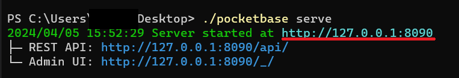

# Pocketbase storage adapter for grammY

Storage adapter that can be used to [store your session data](https://grammy.dev/plugins/session.html) with [Pocketbase](https://pocketbase.io/) when using sessions.

## Usage

### Host a Pocketbase instance

> This package was developed with Pocketbase v0.22.7 in mind, you may upgrade or downgrade your Pocketbase instance version, but full compatibility is not guaranteed

**[Pocketbase v0.22.7 binaries](https://github.com/pocketbase/pocketbase/releases/tag/v0.22.7)**

This package uses the Pocketbase instance URL; You may obtain this after running `./pocketbase serve` in the terminal, in the location that you have extracted your pocketbase binary.

For more information regarding this, read [the official Pocketbase documentation](https://pocketbase.io/docs).

In this example and for ease of prototyping, we will host a Pocketbase instance on our local Windows machine.

After running `./pocketbase serve` in the location in which we extracted the .exe binary, we will be faced with this screen:



> Copy the underlined url, this url will be used for the `pocketbaseInstanceUrl` when using this storage adapter

Open the Admin UI page in your browser, if it's the first time that you are instantiating your Pocketbase instance, go ahead and create your root admin user.

Then from the left sidebar, click on the settings icon and then "Import collections", and paste this configuration:

> Make sure to place your Telegram bot token inside the "your telegram bot token" fields

```
[
    {
        "id": "sxeo80n9r1j23md",
        "name": "sessions",
        "type": "base",
        "system": false,
        "schema": [
            {
                "system": false,
                "id": "rr9dbgn5",
                "name": "key",
                "type": "text",
                "required": false,
                "presentable": false,
                "unique": false,
                "options": {
                    "min": null,
                    "max": null,
                    "pattern": ""
                }
            },
            {
                "system": false,
                "id": "o1epnmt2",
                "name": "value",
                "type": "json",
                "required": false,
                "presentable": false,
                "unique": false,
                "options": {
                    "maxSize": 2000000
                }
            }
        ],
        "indexes": [],
        "listRule": "@request.headers.bot_token = \"your telegram bot token"",
        "viewRule": "@request.headers.bot_token = \"your telegram bot token"",
        "createRule": "@request.headers.bot_token = \"your telegram bot token"",
        "updateRule": "@request.headers.bot_token = \"your telegram bot token"",
        "deleteRule": "@request.headers.bot_token = \"your telegram bot token"",
        "options": {}
    }
]
```

After doing this, there's not much to do with the Pocketbase instance anymore; You may configure your fields, indexes etc... if you are aware of the repercussions

### Use the package in your grammY code

Refer to [Node example](./examples/node.ts)
Refer to [Deno example](./examples/deno.ts)